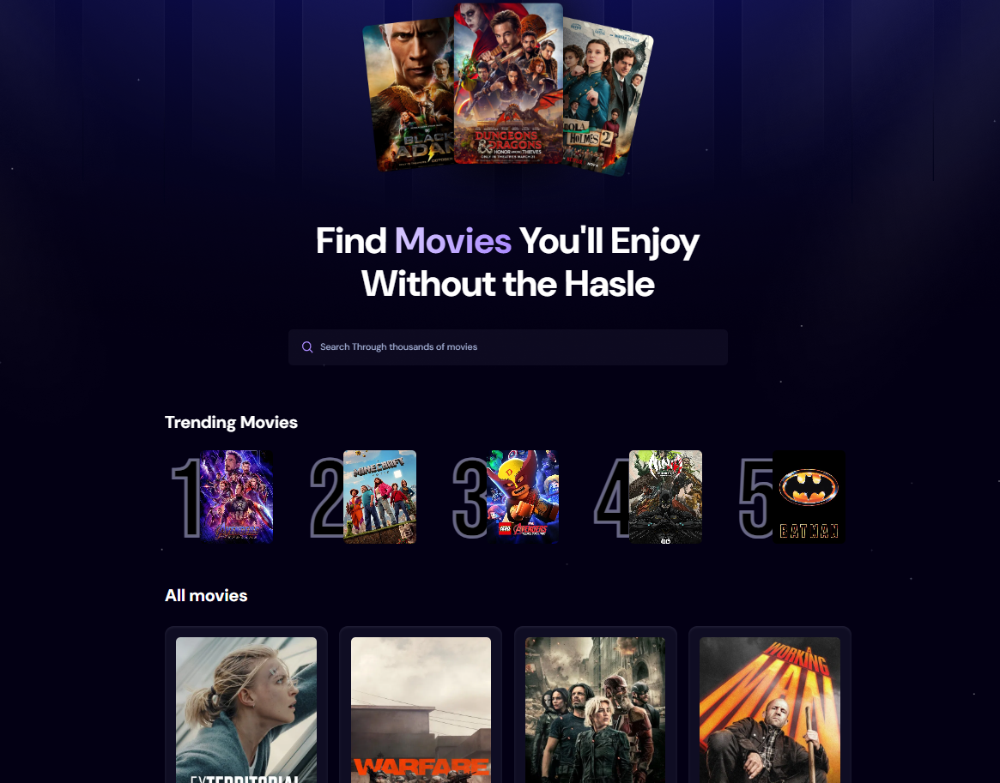

# 🎬 Movie Finder App

Una aplicación web construida con **React** que permite buscar y explorar películas populares, con paginación, búsqueda en tiempo real y un diseño moderno utilizando **Tailwind CSS**.



---

## 🚀 Características

- 🔍 Búsqueda de películas en tiempo real con debounce
- 📄 Paginación interactiva con estados activos y botones "Prev" / "Next"
- 🎞️ Listado de películas populares y trending
- ⏳ Indicador de carga (spinner y skeletons)
- 📱 Diseño responsivo con Tailwind CSS
- 🌐 Consumo de la API de TheMovieDB (TMDb)
- ♻️ Manejo de estado y efectos con React Hooks (`useState`, `useEffect`, `useDebounce`)

---

## 🛠️ Tecnologías utilizadas

- React.js
- Tailwind CSS
- Axios
- React-use (para `useDebounce`)
- Appwrite (para estadísticas de búsqueda, opcional)
- TheMovieDB API

---

## 📦 Instalación

1. Clona el repositorio:

```bash
git clone https://github.com/DevWilfredo/movie-app
cd movie-app
```

2. Instala las dependencias:

```bash
npm install
```

3. Crea un archivo `.env` con tu API key de TMDB:

```env
VITE_TMDB_KEY=your_tmdb_token_here
```

4. Ejecuta la aplicación en modo desarrollo:

```bash
npm run dev
```

---

## 📁 Estructura del Proyecto

```
src/
├── components/
│   ├── Search.jsx
│   ├── Spinner.jsx
│   ├── MovieCard.jsx
│   ├── Pagination.jsx
│   └── SkeletonMovieCard.jsx
├── appwrite.js         # Funciones auxiliares para Appwrite
├── App.jsx             # Componente principal
├── main.jsx            # Punto de entrada de la aplicación
```

---

## 📃 Licencia

Este proyecto está bajo la licencia MIT. Puedes usarlo, modificarlo y compartirlo libremente.

---

## 🤝 Contribuciones

¡Contribuciones, ideas y sugerencias son bienvenidas! Abre un issue o pull request 🚀